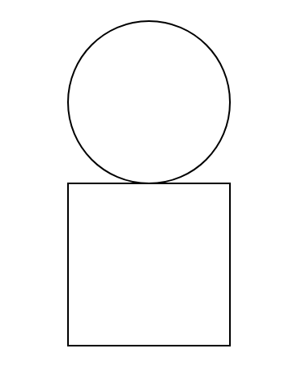
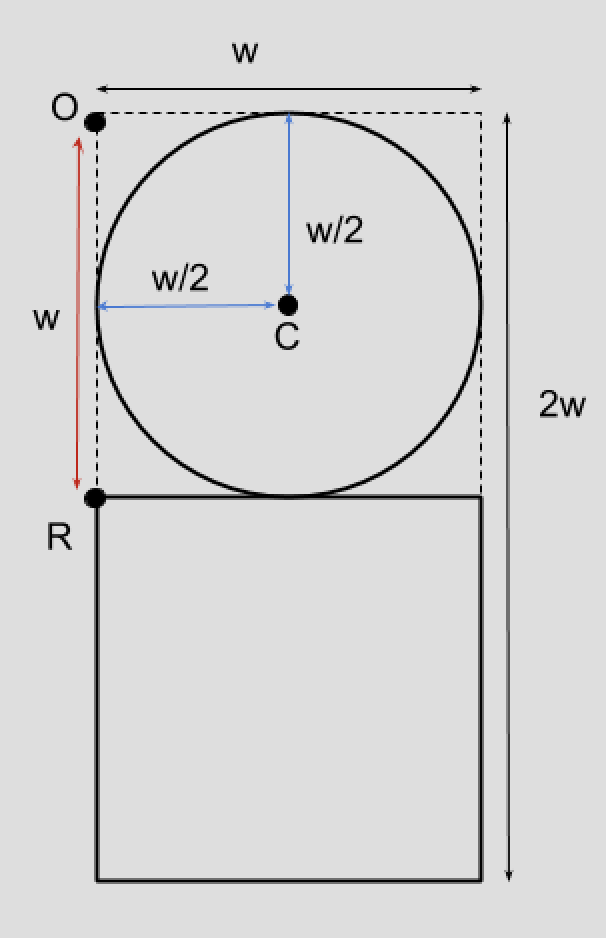
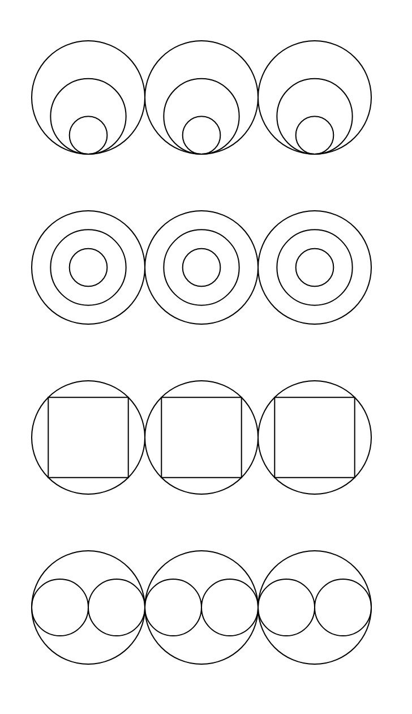
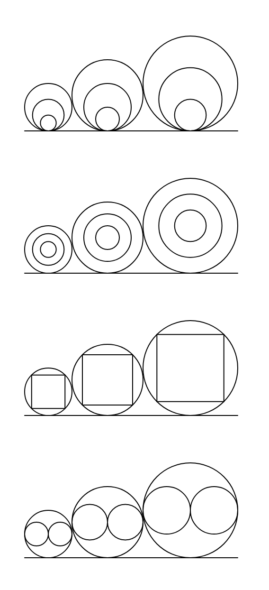

The Elements of Programming
***************************

The Primitives
==============

The `p5.js` environemnt comes with some built-in primitive functions
for drawing various shapes, selecting colors and doing some math operations.

You can visit the `Reference section in p5.js website <https://p5js.org/reference/>`_ 
for details about all the available functions.

shapes
------

circle
~~~~~~

The function ``circle`` draws a circle. 
It takes three arguments, the x and y co-ordinates of the center and the diameter
::

   circle(200, 100, 50);

rect
~~~~

The function ``rect`` draws a rectangle. It takes four arguments, the x and y 
co-ordinates of the top-left corner and width and height of the rectangle.
::

    rect(200, 100, 50, 75);

line
~~~~

The function ``line`` draw a line between two points. It take the coorditates of both ends of the line x1, y1, and x1, y2 as arguments.
::

    line(100, 100, 200, 200);

Math
----

sqrt
~~~~

The `sqrt` function computes the square root of a number.
::

    sqrt(100); // the value of this is 10.0

Generalization
==============

Let's write a program to draw a simple figure shown below. We will call this figure `bob`. 

It is not hard to draw this. It is circle on top of a square. We can achieve this using the followig code::

    rect(200, 200, 100, 100);
    circle(250, 150, 100);

This figure has a width of 100 and a height of 200. What if we want a slightly bigger picture, 
say a width of 150? We will have to find new positions for our rectangle and circle again.

::

    rect(200, 200, 150, 150);
    circle(275, 125, 150);

Every time we want to make some changes to the position and size of the figure, 
we need put the efforts of computing the position and size of the rectangle and circle.

Let us try to understand the relations between the position and size of the figure and position and size of the rectangle and circle drawn for the figure.

We can clearly notice the following facts about the figure.

* The height of the figure is twice its width. Let's say the width of the figure is `w`.
* The top-left corner of the rectangle is vertically below the top-left corner of the figure and distance between then is `w`.
* The center of the circle at a distance of `w/2` in both horizontal and vertical directions from the top-left corner of the figure.
* The width and height of rectangle is `w`
* The diameter of the circle is also `w`.

So, given `(x, y)` coordinates of the top-left corner and width of the figure, 
we can find out everything else is that is required to draw our figure.

It can be done in code as shown in the example below.

::

    // The top-left corner and width of the figure
    var x = 200;
    var y = 200;
    var w = 100;

    // the top-left coordinates of the rectangle
    var rx = x;
    var ry = x + w;

    // the center of the circle
    var cx = x + w/2;
    var cy = y + w/2;

    // now that we have computed all the positions,
    // let's draw the figure
    rect(rx, ry, w, w);
    circle(cx, cy, w);

This may look like a complicated program, but we are exactly doing the same thing 
that we did before, except that now we are working with names like x and y instead
of numbers.

Notice that we've used a new programming constuct called `var`. It is used to define a new variable. 
A variable is a name that holds some value. In the above example, the variable `cx` will hold the value
of the expression `x + w/2`. Since `x` is `200` and `w` is `100`, the value of the expression will be `250`.

The advantage of this approach is that we are defining expressions (of formulae) for computing all the required positions 
and let the computer compute them. If we change the input values, the expressions will be automatically computed. 

Try changing the w to 150 and the figure will be grow bigger.

Functions
=========

In the previous section we have generalized the computation all the postions 
required to draw the figure by using variables and expressions. 
Now let's say we want to draw that figure twice? Wound't it be too cumbersome to 
copy the same code and put it again? What if I want to draw it a thousand times? 

Functions helps us solve this very problem. We can define a function to draw this 
figure and we can just ask the compute draw the figure by calling that function. 
We can give any name to the function, let's call the figure `bob` and use the same name for the function.
::

    function bob(x, y, w) {
        // the top-left coordinates of the rectangle
        var rx = x;
        var ry = x + w;

        // the center of the circle
        var cx = x + w/2;
        var cy = y + w/2;

        // now that we've computed all the positions, let's draw the figure
        rect(rx, ry, w, w);
        circle(cx, cy, w);
    }

    function draw() {
        // draw the bob figure twice in two different sizes
        bob(200, 200, 100);
        bob(400, 200, 200);
    }

Let's see what we have done here. We've taught the computer how to draw the figure bob. Now that the computer knows how to draw bob, 
we can just instruct the computer to draw bob, just by calling the `bob` function, just like how we call the `circle` or `rect` functions. 

Combining complex ideas and giving it a name by defining a function is one of fundamental concepts
of programming and this is a building block for managing complexity in our programs.

More Generalization
===================

Let's saw we want to draw there bob figures in a row.

We can do that using the following code::

    function draw() {
        bob(100, 100, 100);
        bob(250, 100, 100);
        bob(400, 100, 100);
    }

In the above example, there is gap of 50 pixels between each figure. What if I want to do the same for some other figure, say drawing three circles? 
We'll have to repeat the same exercise with the new shape. Wouldn't it be nice if we can write a function to capture this pattern? 

Let's write a function `threeInRow` that draws any given shape three times in a row. But, how will it know what shape to draw? 
Well, we can pass the function to draw as an argument to the `threeInRow` function. Let's look at the cod below to understand 
this.
::

    function threeInRow(f, x, y, w) {
        var gap = w/2;
        var x0 = x;
        var x1 = x + w + gap;
        var x2 = x1 + w + gap;

        f(x, y, w);
        f(x1, y, w);
        f(x2, y, w);
    }

    function draw() {
        // draw three bob figures in a row
        threeInRow(bob, 100, 100, 100);

        // draw three circles in a row
        threeInRow(circle, 100, 400, 100);
    }

Just like we can pass numbers as arguments to function, we can also pass other functions as arguments.
This is very interesting idea and quite useful too. We'll see more examples of that in shortly.

Exercises
=========

Write programs to draw the following shapes.

**Problem 2.1**

   Three shapes in a row.

**Problem 2.2**

   Three shapes in a row with growing size.
