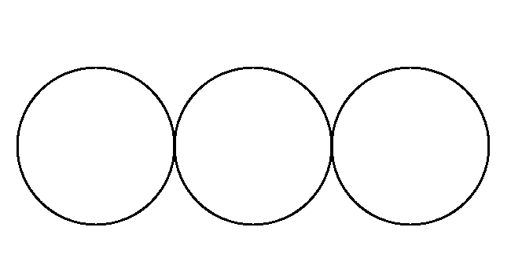

Getting Started
===============

Exercises
---------

Write programs to draw the following patterns.

**Problem 1.1**

   Three circles in a line.

**Problem 1.2**

   Three concentric circles.

**Problem 1.3**

   Three circles touching at bottom.

**Problem 1.4**

   Two small circles in a big circle.

**Problem 1.5**

   Plus/cross pattern.

**Problem 1.6**

   Four small squares touch the four corners of a big square.

**Problem 1.7**

   Circle in a square.

**Problem 1.8**

   Square in a circle.
