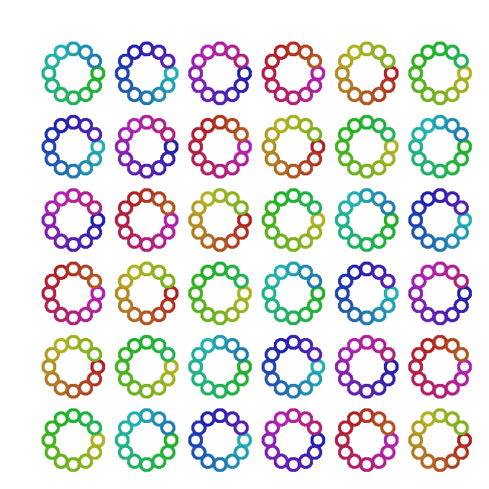

Creative Coding
===============

*The Joy of computer programming through generative art!*

The Creative Coding Workshop introduces the joy of programming to young students through generative art.

This workshop is based on `p5.js <https://p5js.org/>`_, a JavaScript library for creative coding. During the workshop,
the participants will be learning programming concepts by creating beautiful art.

The medium of programming allows them to play with concepts such as repetition, randomness, recursion to create stunning images and animation.

With a computer at your hands and your thoughts as the only raw material, you are only limited your own imagination. Ready to dive in?

Topics
------

.. toctree::
   :maxdepth: 2

   getting-started
   variables
   elements-of-programming
   repeating
   random