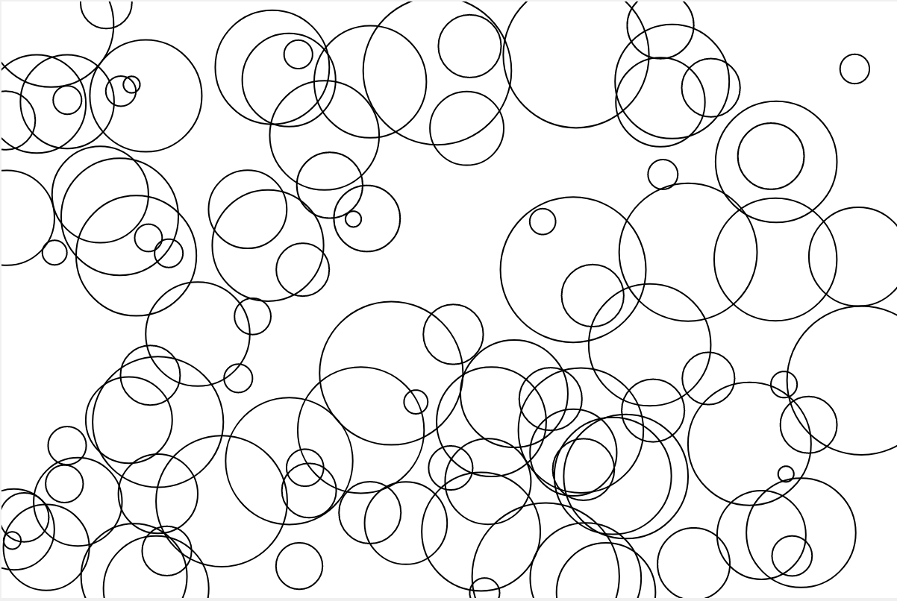
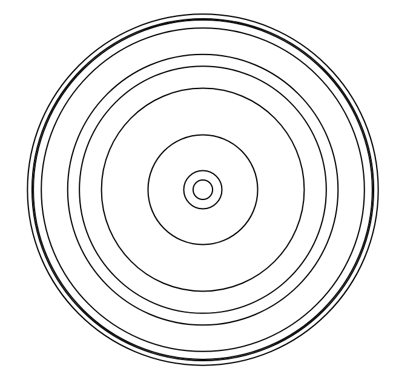
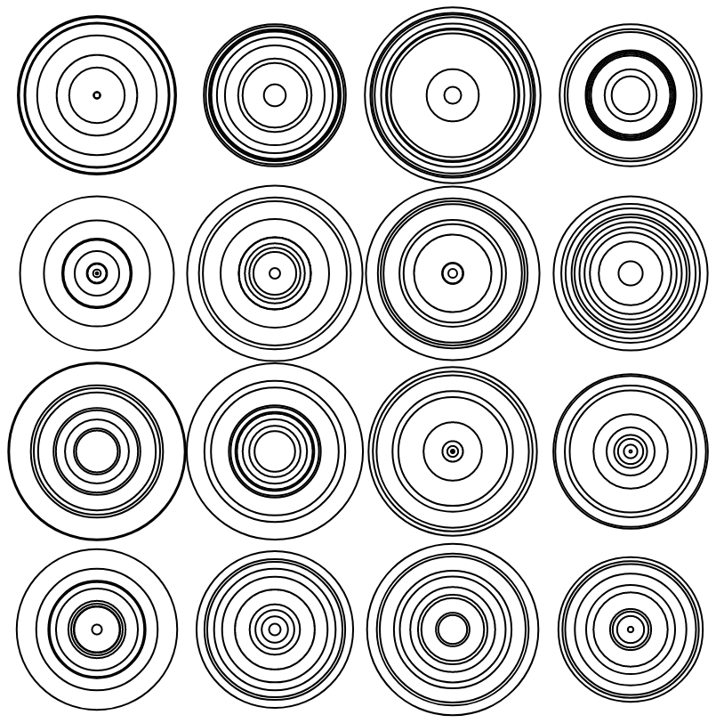

Randomness
**********

Exercises
=========

**Problem 4.1** Write a program to draw 100 circles at random locations with random size.

**Problem 4.2** Write a program to draw concentric circles of random size.

**Problem 4.3** Can you place the random concentric circles drawn in the above problem in grid?

