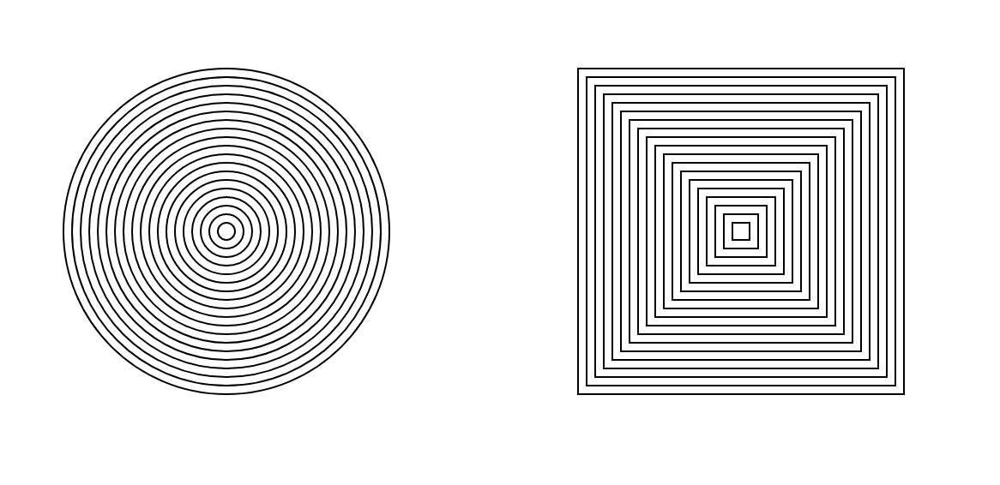
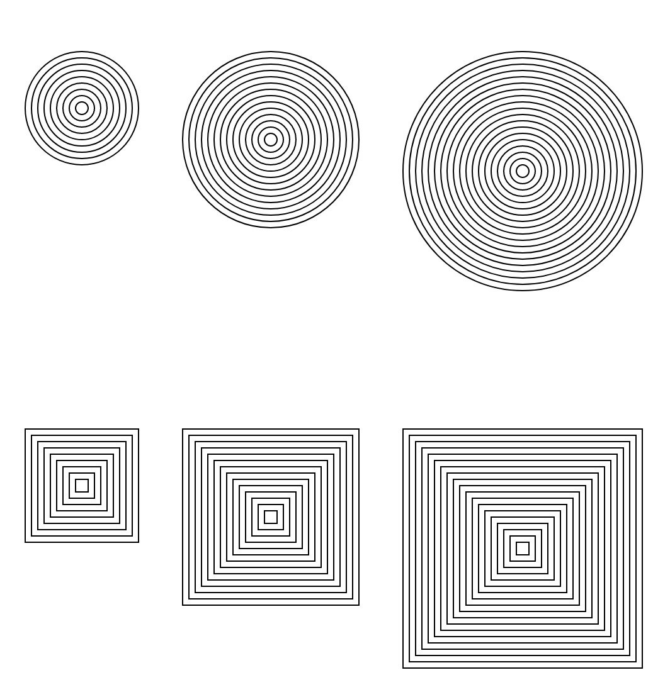
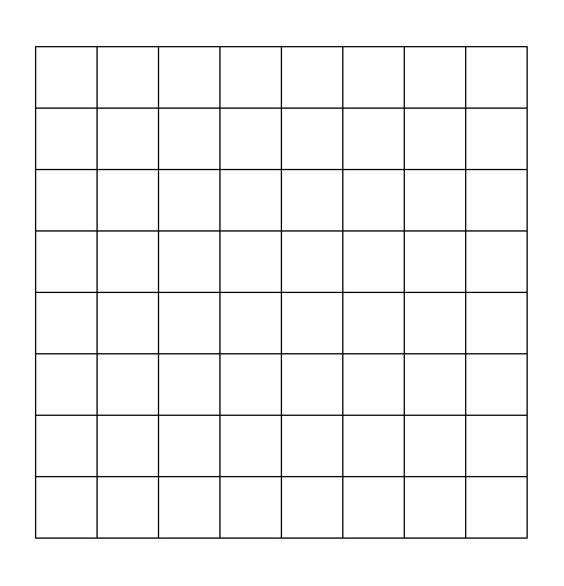
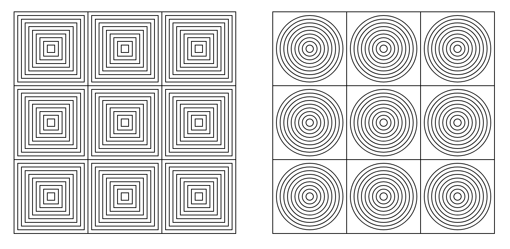

Repeating Things
****************

Imagine you want to draw a hundred circles. It would be too cumbersome to write 100 lines of code to do circles. 

The For Loop
============

The following example draws concentric circles
::

    function draw() {
        for (var d=10; d<50; d=d+10) {
            circle(400, 400, d);
        }
    }

The *for* loop is a construct available in the Javascript programming language to loop over a sequence of numbers. 

A *for* loop will of the following form::

    for (initial_state; loop_condition; increment) {
        body
    }

The for loop continues to execute the ``body`` repeatedly as long the ``loop_condition`` is satisified. Each execution is called as as *iteration*.

A loop typically have a loop variable and the ``initial_state`` specifies the initial value for the loop variable. 
In our example, the loop variable is ``d``, representing the diameter of the circle that we want to draw and is initialized to ``10``.

The ``loop_condition`` specifies the condition that must be satisified for the loop to continue. In our example,
we want to continue the loop as long as the value of ``d`` is less than ``400``.

The ``increment`` specifies how should the loop variable change after each iteration of the loop. In our example, 
we want to incrent ``d`` by 10.

When we run the program, it will draw 4 concentric circles with diameter ``10``, ``20``, ``30`` and ``40``. 
Notice that it will not draw cicle with diameter ``50`` as the condition is ``d < 50`` and not ``d <= 50``.

You can change the value from ``50`` to ``500`` to get lot more concentric circles.

Exercises
=========

Write programs to draw the following shapes.

**Problem 3.1**

   Concentric circles and squares.

**Problem 3.2**

   Three concentric circles and squares in a row.

**Problem 3.3**

   8x8 grid

Hint: You can use the `line function <https://p5js.org/reference/#/p5/line>`_.

**Problem 3.4**

   concentric squares and circles in a grid.

